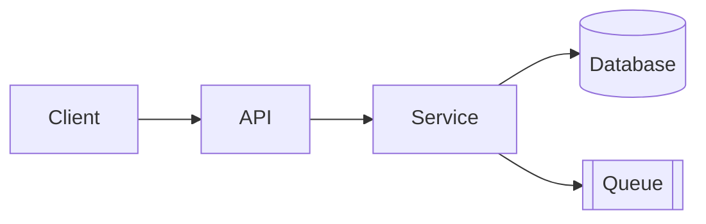

# Technical Overview Strategy

Technical overview is for reader who decided to engage and wants to understand how project works inside. Not tutorial, not marketing, not reference manual. Conceptual map of system.

Place at `docs/technical-overview.md` unless repo already follows different convention.

## Audience and Job

Audience: developers, integrators, contributors who know what project does and want to understand how it works, where to look in code, how to extend or operate it.

Job: enough mental model to navigate codebase, integrate, contribute, or debug — without reading every file.

## Section Order

Use this order. Skip section only when it genuinely doesn't apply.

1. **Purpose and scope** — Paragraph framing what doc covers and what it deliberately excludes.
2. **System summary** — Short description of what system is, main responsibilities, boundaries. One diagram if helpful.
3. **Architecture** — Major components, how they fit, responsibility of each. Diagram or labeled table.
4. **Data flow** — How request, event, or input moves through system and what happens at each step.
5. **Key concepts and domain model** — Important nouns and how they relate. Link to README key concepts for user-facing version.
6. **Technology stack** — Languages, frameworks, runtime, storage, external services. One-line reason per major choice.
7. **Repository map** — Where to find what in source tree. Table: folders/files → responsibilities.
8. **Configuration and environments** — How config is loaded, what environments exist, how they differ.
9. **Integration and extension points** — APIs, plugin hooks, events, extension surfaces for other systems or contributors.
10. **Operational concerns** — Logging, observability, deployment, scaling, security model at high level.
11. **Design decisions and tradeoffs** — Notable choices, alternatives considered, why current approach won. Reference ADRs when they exist.
12. **Glossary** — Optional; for domain terms reader unlikely to know.

## Diagram Guidance

- Prefer simple component or sequence diagrams. Mermaid renders on GitHub.
- Label every box and arrow.
- One idea per diagram.
- Update prose when diagram changes; never let them drift.

Example:

````markdown

````

## Repository Map Pattern

```markdown
## Repository map

| Path | Responsibility |
|------|----------------|
| `src/api/` | HTTP entry point and request validation |
| `src/service/` | Business logic and orchestration |
| `src/data/` | Persistence and query helpers |
| `tests/` | Automated tests |
| `docs/` | Documentation, including this overview |
```

Pick directories that matter for orientation. Don't list every folder.

## Linking Strategy

- Link from README "Additional resources" into technical overview.
- Link from quickstart "Next steps" and "Going further" when internals help reader continue.
- Link from inside technical overview into specific source files via relative paths — power user navigates by code, not prose.
- Add short "Where to start reading" subsection near top so contributors jump straight to relevant section.

## Style Guidance

- Be concise. Favor diagrams, tables, short paragraphs over long prose.
- Present tense, active voice.
- Name components consistently with code.
- No step-by-step instructions — those belong in quickstart guides.
- Prefer "service does X" over "we made service do X".

## Update Strategy

When updating existing technical overview:

- Verify component names and paths against current code.
- Replace stale diagrams; no two diagrams in disagreement.
- Move tutorial content into quickstart guides.
- Move user-facing capability descriptions into README.

## Quality Checks

- Reader can name major components after one read.
- Reader can find right folder for given concern via repository map.
- Diagrams match prose and code.
- Design decisions explain *why*, not just *what*.
- Doc doesn't duplicate functional content from README or quickstart guides.
